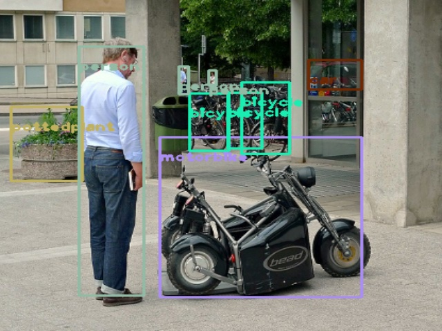

# YOLO Object Detection Using the OpenCV Library

This project demonstrates object detection using the YOLO algorithm with OpenCV in Python. The provided code loads a pre-trained YOLO model and performs object detection on a given image, displaying the detected objects with bounding boxes.

# Prerequisites

## 1. Python 3.9
## 2. OpenCV
## 3. NumPy

# Installation

### 1. Clone the Repository
bash
Copy code
git clone [https://github.com/AlirezaHabibi1377/YOLO-Object-Detection](https://github.com/AlirezaHabibi1377/YOLO-Object-Detection.git)
cd yolo-object-detection

### 2. Set Up Virtual Environment (Optional but Recommended)
bash
Copy code
python -m venv venv
source venv/bin/activate  # On Windows use `venv\Scripts\activate`

### 3. Install Dependencies
bash
Copy code
pip install opencv-python numpy

# Usage

### 1. Prepare YOLO Model Files
Download the YOLO model configuration, weights, and class names files. Ensure the following files are available in the specified paths:

yolov3.cfg (YOLO configuration file)
yolov3.weights (YOLO pre-trained weights)
coco.names (COCO class labels)
Update the paths in the script to point to these files.

### 2. Update Image Path
Set the path to the image you want to use for object detection. Update the img_path variable in the script:

python
```bash
img_path = r"E:\Perception working\Opencv\yolo_object_detection\sample5.jpg"  # Change this to your image path
```

### 3. Run the Script
Execute the Python script:

```bash
python yolo_object_detection.py
```
# Outputs





# Contact

My email: [mo.alireza77habibi@gmail.com](mailto:mo.alireza77habibi@gmail.com)
